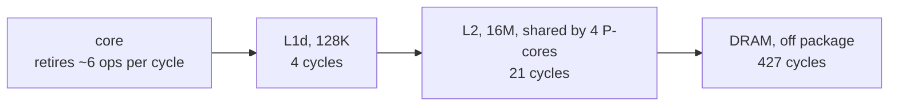
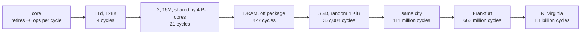

# Napkin math

## In one line
The latency and throughput constants worth memorising, so a design can be rejected
on arithmetic before anyone writes code. Every one of them is either a cycle count
or a distance divided by a propagation speed, so none of them has to be memorised.

## Why must it be this way?

Start from the only unconditional truth here. Everything a computer does is one of
exactly two things:

1. Retire an instruction in a core.
2. Move a byte across a distance.

That is the complete list. So every number on a napkin table is either a cycle
count or a distance over a speed, and both are derivable.

### The hierarchy is forced, not designed

Two physical constraints push the same way.

**Distance is latency.** One cycle on this laptop is `0.227 ns`. Light in vacuum
covers `6.8 cm` in that time; a signal in on-chip metal, loaded with RC and
repeaters, covers `1 cm` to `2 cm`. Anything further from the load unit than about
a centimetre cannot answer in one cycle. Not "is slow to answer". Cannot.

Array geometry then decides the levels. A `128 KiB` SRAM array is a fraction of a
millimetre across and sits inside that radius. A `16 MiB` array is `5 mm` to `6 mm`
across and shared by four cores, so the wire eats cycles before the sense amps
fire. DRAM is a separate package centimetres away on a bus that needs turnaround.

**Density is cost.** SRAM is 6 transistors per bit. DRAM is 1 transistor plus 1
capacitor. NAND holds 3 to 4 bits in one cell with the power off. Cost per byte
falls by orders of magnitude down that list, so `16 GB` of L1 is unbuildable at any
price, and by the first constraint it would be slow anyway.

Small and close, or large and far. Never both. That is a hierarchy, and it is the
only shape satisfying both constraints.

**Below DRAM a motor sets the number, not a wire.** A 7200 rpm platter turns once
in `8.3 ms`, so average rotational latency is half that, `4.2 ms`, by arithmetic
alone. Seek time comes on top and is a datasheet figure rather than something
measurable here, since this machine has no spinning disk. Rotation alone already
puts a spinning disk in the milliseconds, which is where `1 ms` to `10 ms` comes
from, and it makes this the one row on any napkin table derivable with no benchmark
at all. NAND has no moving parts, which is the whole reason an SSD lands two orders
of magnitude lower.

**Locality is what makes it pay.** Under uniform random access over `16 GB` every
level above DRAM is dead weight and every access costs the DRAM number. Real
programs reuse. That is the whole bet, and it is why the benchmark below destroys
locality on purpose: it chases a random permutation of cache lines, every load
depending on the one before, so no prefetcher and no out-of-order window can hide
anything. What comes out is the raw latency of whichever level holds the working
set.

### Which address bits move matters as much as how many bytes

Working-set size picks the level only when the addresses spread across the cache's
set-index bits. Touch one cache line per page at the same offset in every page and
every address shares those bits, so the whole access pattern lands in a handful of
sets and evicts itself. Measured, at `65{,}536` live pages holding `8 MiB` of data
either way:

| line picked in each page | load latency |
|---|---|
| a random offset inside the page | `13.51 ns` |
| always offset 0 | `97.84 ns` |

Same footprint, same page count, same random page order. The `7.2` times gap comes
from address bits alone, and `97.84 ns` is indistinguishable from a DRAM miss even
though the data fits in L2 six times over.

The same sweep prices address translation. Latency stays flat while the live page
count fits the L2 TLB, then steps once past roughly `3{,}072` pages, from
`6.86 ns` to `12.19 ns`. So a page walk with cached page tables costs about
`5 ns`, some `23` cycles, and it does not explain the DRAM plateau: `65{,}536` live
translations with a small footprint still read `13.51 ns`, not `97 ns`. The
plateau is a real DRAM access.

### The clock calibrates itself

The benchmark never asks the vendor what the clock is. An integer add has one cycle
of latency on any core worth measuring, so timing a chain of dependent adds gives
the clock period directly, and every cache latency then converts to cycles with no
spec sheet involved.

The check that the method works: L1 came out at exactly `4.0` cycles. Cache latency
has to be an integer number of cycles, so landing on `4.00` validates the clock
estimate. A bad estimate reads `3.7` or `4.4`.

### The memory wall, stated as one line

$$
\text{one DRAM miss} = 96.82\ \text{ns} = 427\ \text{cycles} = 2362\ \text{integer ops}
$$

A cache miss is not a tax on the compute budget. It is the budget.

### The network floor comes from glass, not from routers

Long-haul fibre is silica with a group refractive index near `1.47`, so light in it
moves at $c/1.47 = 203{,}940$ km/s. Round trip:

$$
\text{RTT}_{\min} = \frac{2d}{203{,}940\ \text{km/s}} \approx 9.81\ \mu\text{s} \cdot d_{\text{km}}
$$

Ten microseconds per kilometre, round trip. That single constant replaces every
network row on any napkin table, and no budget beats it.

Within one metro the floor stops mattering. Fifty kilometres of fibre is `0.5 ms`
round trip, so a same-region figure near `1 ms` is almost entirely switch hops,
proxy layers, and queueing. Distance only takes over once the path leaves the
region.

Reality runs `1.3` to `2.5` times the floor. The low end is a well-peered trunk:
New York to London is about `5{,}500 km`, floor `54 ms`, and
[cloudping.co](https://www.cloudping.co/) reports `us-east-1` to `eu-west-1` at
`69.41 ms`, which is `1.29` times the floor. The high end is what transit hops and
fibre that ignores the great circle cost: from this laptop to Frankfurt is
`6{,}600 km` great circle, floor `64 ms`, measured `150.4 ms`, which is `2.3` times
the floor.

### Latency and throughput are not the same number

A latency-only table cannot cost a single design. The bridge between the two is one
multiplication:

$$
\text{crossover size} = \text{latency} \times \text{bandwidth}
$$

Below that size the cost is latency; above it the cost is bandwidth. The same
product is the bytes that must stay in flight to saturate the level.

| level | latency times bandwidth | crossover |
|---|---|---|
| DRAM | `96.82 ns` times `67.2 GB/s` | `6.5 KB` |
| SSD | `76.5 us` times `1.95 GB/s` | `149 KB` |
| link to Frankfurt at 100 Mbit/s | `150.4 ms` times `12.5 MB/s` | `1.9 MB` |

Read those as: a `4 KB` DRAM read is a latency problem and a `64 KB` one is a
bandwidth problem; below `149 KB` the SSD does not care how much was asked for;
`1.9 MB` has to be in flight to Frankfurt before the pipe is full, which is why one
TCP stream with a small window gets nowhere across an ocean.

> One device spans `54 MB/s` random at queue depth 1 and `1.95 GB/s` sequential, a
> factor of 36. Any estimate using one number for "disk" is wrong by up to that
> factor.

## What does it cost?
| metric | value | unit | command |
|---|---|---|---|
| clock period, M4 P-core | 0.227 | ns | `cc -O2 -o /tmp/napkin_mem tools/napkin_mem.c && /tmp/napkin_mem` |
| integer op, independent, same core | 0.040 | ns | as above |
| failing syscall, `close(-1)` | 95 | ns | as above |
| L1d hit, 128 KiB working set | 0.91 | ns | as above |
| L2 hit, 256 KiB working set | 4.70 | ns | as above |
| DRAM random read, 256 MiB working set | 96.82 | ns | as above |
| sequential read, 1 thread | 67.2 | GB/s | as above |
| sequential read, 6 threads | 103.1 | GB/s | as above |
| L2 TLB reach | 3072 | pages | as above, latency steps between 3072 and 4096 |
| page walk on an L2 hit, cached tables | 5.3 | ns | as above, 12.19 minus 6.86 |
| 8 MiB touched, random offset per page | 13.51 | ns | as above |
| 8 MiB touched, offset 0 in every page | 97.84 | ns | as above |
| SSD random read 4 KiB, QD1, median | 76.5 | us | `uv run tools/napkin_io.py` |
| SSD random read 4 KiB, QD1, p99 | 87.5 | us | as above |
| SSD sequential read, 1 MiB blocks, QD1 | 1.95 | GB/s | as above |
| SSD sequential write, 8 KiB, fsync each | 230.9 | MB/s | as above |
| RTT to `ap-south-1` Mumbai | 25.3 | ms | as above |
| RTT to `ap-southeast-1` Singapore | 44.0 | ms | as above |
| RTT to `eu-central-1` Frankfurt | 150.4 | ms | as above |
| RTT to `us-east-1` N. Virginia | 252.5 | ms | as above |
| RTT to `sa-east-1` Sao Paulo | 361.8 | ms | as above |
| fibre propagation speed, c/1.47 | 203940 | km/s | `python3 -c "print(299792.458/1.47)"` |
| RTT floor per km of fibre | 9.81 | us | `python3 -c "print(2/203940*1e6)"` |
| AWS `us-east-1` to `eu-west-1` RTT | 69.41 | ms | cloudping.co dashboard, not measured on this box |
| New York to London RTT | 70.5 | ms | wondernetwork.com/pings, not measured on this box |

Machine for every measured row: MacBook Pro, Apple M4, 4 P-cores plus 6 E-cores,
`16 GB` unified memory, macOS.

The latency rows repeat across runs to within 1%, because `best` takes the fastest
of several runs and a loaded machine only ever makes a single sample slower. The
two bandwidth rows do not: four runs gave `66.9`, `67.0`, `67.2`, and `49.7 GB/s`
single-threaded, the last one on a box that was also compiling. Treat the
bandwidth figures as valid only on an otherwise idle machine, and re-run before
quoting them. GPU numbers are not in this note and would come from
bqa3.

## What breaks without it?

Two designs die in ten seconds each.

**One DRAM random access per item.** `96.82 ns` per item caps a core at `10.3 M`
items/s. A target of `1 M`/s ships with 10x headroom. A target of `1 B`/s is
unreachable by code changes; the data layout has to change so the access is
sequential and pays `67.2 GB/s` instead. That is a layout decision, and it is
cheapest before the code exists.

**N sequential round trips to another region.** At `150.4 ms` to Frankfurt, 20
sequential round trips is `3 s`, and no profiler ever shows a hot function. The
arithmetic kills the design up front or three weeks of investigation finds it
later.

**A record size that is a power of two.** An array of `16 KiB` records walked one
field per record puts every touched line in the same cache sets, and the loop reads
out at DRAM latency while its live data fits in L2. Measured here as `97.84 ns`
against `13.51 ns` for the same bytes at spread offsets. The fix is padding the
stride off the power of two, which no profiler will suggest.

The failure mode of not knowing the numbers is not a slow program. It is
optimising the wrong layer: shaving instructions off a loop that spends `427` of
every `431` cycles waiting for DRAM.

## Diagram

### Stage 1: the unconditional two boxes


### Stage 2: distance splits the byte's home into levels

Cycle counts, not nanoseconds, because one unit across the whole hierarchy is what
makes the scale legible.



### Stage 3: the levels that leave the package



Each arrow is roughly two orders of magnitude. Eight orders separate a register
from another continent, which is why one badly placed round trip outweighs every
instruction-level decision in a program.

### The measured curve

The plateaus and the two cliffs are the hierarchy reading itself out.

![[napkin-math-1.svg|760]]

### The same data at two different strides

Both curves touch `8 MiB`. The orange one only changes which bits of the address
vary.

![[napkin-math-2.svg|760]]

## In code

`learning/tools/napkin_mem.c`, 285 lines, built and run with:

```bash
cc -O2 -Wall -o /tmp/napkin_mem tools/napkin_mem.c && /tmp/napkin_mem
```

| function | lines | what it measures |
|---|---|---|
| `cycle_ns` | 32:51 | clock period, from ten dependent `add` instructions per loop body |
| `add_throughput_ns` | 55:72 | issue width, from eight independent chains |
| `chase_build` | 74:97 | a random Hamiltonian cycle over the cache lines of a buffer |
| `chase_ns` | 99:110 | load latency at one working-set size |
| `tlb_ns` | 119:155 | load latency at one live-page count, in both offset modes |
| `seq_read_gbs` | 158:174 | single-thread streaming read |
| `seq_read_threaded_gbs` | 212:232 | streaming read across N threads |
| `syscall_ns` | 189:194 | user to kernel transition, via `close(-1)` |

The boundary shapes: `chase_build` returns a `uint32_t *` of `bytes / 128` lines
where each line's first word holds the word index of the next line, so the chase
body is one line, `idx = buf[idx]`. `tlb_ns` uses the same encoding over
`npages * 16384` bytes and touches one line per page.

Four things the code carries that the prose above does not:

Every timing loop ends in a fake use of its accumulator, `if (x == 0) printf(...)`.
Without it `-O2` deletes the loop and the benchmark reports zero.

`chase_ns:103` and `tlb_ns:148` run `200,000` untimed steps first. Their job is
first-touch page faulting, not cache warming; a fault inside the timed region shows
up as a latency outlier of several microseconds.

`best` at 176:180 takes the fastest of k runs. macOS migrates the thread between
P-cores and E-cores mid-run, and an E-core run reads out as a `2.70 GHz` clock
instead of `4.40 GHz`. `QOS_CLASS_USER_INTERACTIVE` at line 235 does not prevent
it.

`seq_read_threaded_gbs:216` fills the buffer from the main thread, so on a NUMA
machine every page lands on one node and the threaded number would be wrong. This
chip has unified memory, so it does not matter here, and it would have to change
before the same file runs on a two-socket box.

`learning/tools/napkin_io.py` covers the SSD with `fcntl(F_NOCACHE)` so the page
cache cannot answer a read, and the network with TCP handshake time, which is
exactly one round trip. `F_NOCACHE` is hardcoded as `48` at line 27 because
Python's `fcntl` module does not export it, and the constant is macOS only. On
Linux the equivalent is `O_DIRECT` with an aligned buffer, so this file measures
nothing useful on bqa3 as written.

`learning/tools/napkin_plot.py` regenerates both SVGs from the same run:

```bash
uv run tools/napkin_plot.py hierarchy > viz/napkin-math-1.svg
uv run tools/napkin_plot.py stride    > viz/napkin-math-2.svg
```

The line that took longest: `tlb_ns:131`, choosing a random line inside each page
instead of line 0. The first version used line 0 and read `95 ns` flat, which
looked like proof that address translation dominates the DRAM number. It was
measuring cache set conflicts instead.

## What did implementing correct?

### 2026-08-27 - implementing the harness
**I thought:** working-set size decides which level answers a load, so the curve of
latency against footprint is the whole hierarchy.
**Actually:** footprint decides which level *could* answer. Which address bits vary
decides whether it does. At a fixed `8 MiB` footprint and a fixed `65{,}536` live
pages, latency reads `13.51 ns` with a random line offset per page and `97.84 ns`
with offset 0 in every page, because offset 0 makes every address share its cache
set-index bits.
**How I found out:** wrote `tlb_ns` to price address translation, got `95 ns` flat
at every page count, and could not reconcile that with an `8 MiB` footprint that
fits in a `16 MiB` L2. Randomising the offset inside each page dropped it to
`13.51 ns` and separated the two effects. The page walk turned out to cost about
`5 ns`, not the `90 ns` the broken version implied.
**Code:** learning/tools/napkin_mem.c:119 (uncommitted)

### 2026-08-27 - reading the source
**I thought:** a CPU instruction costs `1 ns`.
**Actually:** two different numbers hide under "an instruction". A dependent op has
one cycle of latency, `0.227 ns` on this machine. Independent ops retire `5.6` per
cycle, `0.040 ns` each. So `1 ns` is 4x too slow for latency and 25x too slow for
throughput, and it also contradicts the `4 GHz` written on the same slide, where a
cycle is `0.25 ns`.
**How I found out:** timed a dependent `add` chain against eight independent ones.
The `1 ns` figure traces to the 2009 Dean and Norvig list, whose row reads "execute
typical instruction: 1 ns". It describes a scalar core at roughly `1 GHz`. This
core is 8-wide.
**Why it matters:** this is the denominator of every "is it worth optimising"
decision. At `1 ns` per instruction a 100-instruction function looks like a DRAM
miss, so the arithmetic gets optimised instead of the access pattern. The real cost
of 100 independent instructions is `4 ns`, and the DRAM miss is 24x that.

### 2026-08-27 - reading the source
**I thought:** L3 cache costs `10 ns`.
**Actually:** this chip has no L3. The curve steps from `14.34 ns` at a `16 MiB`
working set straight to `62.00 ns` at `32 MiB`, because L2 is `16 MiB` and shared
by the four P-cores, and below it is DRAM. On a server x86 where L3 is real it
costs `30 ns` to `50 ns`, not `10 ns`. So the row is wrong on both machines:
absent here, and 3 to 5 times optimistic there.
**How I found out:** `sysctl hw.perflevel0.l2cachesize` reports `16777216`, and the
pointer chase shows the cliff exactly there.

### 2026-08-27 - reading the source
**I thought:** east US to EU is `150 ms`.
**Actually:** `69.41 ms` on `us-east-1` to `eu-west-1`, and `70.5 ms` New York to
London. The `150 ms` figure is real but belongs to a different pair of cities: the
2009 list's row is California to Netherlands and back, `8{,}800 km`, whose floor is
`86 ms`. A California number got copied into an east-coast row.
**How I found out:** derived the floor from `9.81` us per km and checked it against
[cloudping.co](https://www.cloudping.co/). The east US to APAC guess of `200 ms`
survives the same check: New York to Singapore is `15{,}300 km`, floor `150 ms`, so
`200 ms` is `1.33` times the floor and near optimal.

### 2026-08-27 - reading the source
**I thought:** a table of latencies is what napkin math is.
**Actually:** latency alone cannot cost any design, because it never answers "how
long for N bytes". The same SSD spans `54 MB/s` and `1.95 GB/s` depending only on
access pattern. The missing column is throughput, and the number joining them is
the crossover size, latency times bandwidth.
**How I found out:** tried to use the numbers to size a `1 MB` transfer and found
the table had nothing to divide by. The sirupsen table carries per-`1 MiB` and
per-`1 GiB` columns for exactly this reason.

### 2026-08-27 - reading the source
**I thought:** a chip's memory bandwidth is a per-machine number and one thread
gets a small slice of it.
**Actually:** true on x86, false here. One thread measures `67.2 GB/s` and six
threads peak at `103.1 GB/s`, so a single core takes roughly two thirds of the
machine. The
sirupsen table's `20 GiB/s` single-thread against `200 GiB/s` threaded is a 10x
ratio that holds for a many-core Xeon and not for this chip.
**How I found out:** swept thread count from 1 to 10 in `seq_read_threaded_gbs`.

## What does this rest on?

- The speed of light, and the group refractive index of silica fibre near `1.47`.
- Cost per bit of SRAM, DRAM, and NAND, which is what forces more than one level.
- Locality of reference, which is what makes any level above DRAM pay for itself.
- Nothing else in this vault yet.

## Sources
- [sirupsen/napkin-math](https://github.com/sirupsen/napkin-math), whose table is
  re-measured on GCP `c4-standard-48-lssd` and rounded for memorisation, with the
  author's own tolerance stated as 2 to 3 times.
- [Latency numbers every programmer should know](https://gist.github.com/jboner/2841832),
  the 2009 Dean and Norvig list. Three mutually inconsistent versions circulate;
  [Norvig's own page](https://norvig.com/21-days.html) has no SSD rows and gives
  disk seek as `8 ms`, and
  [Google's SRE sheet](https://sre.google/static/pdf/rule-of-thumb-latency-numbers-letter.pdf)
  gives L1 `1 ns`, L2 `4 ns`, and a 4 kB SSD random read of `20 us`. The SRE sheet
  is the closest of the three to what this laptop measures.
- [cloudping.co](https://www.cloudping.co/) for live AWS inter-region RTT.
- [wondernetwork.com/pings](https://wondernetwork.com/pings) for city-pair RTT.
- The slide these claims came from:

![[napkin-math.png]]
